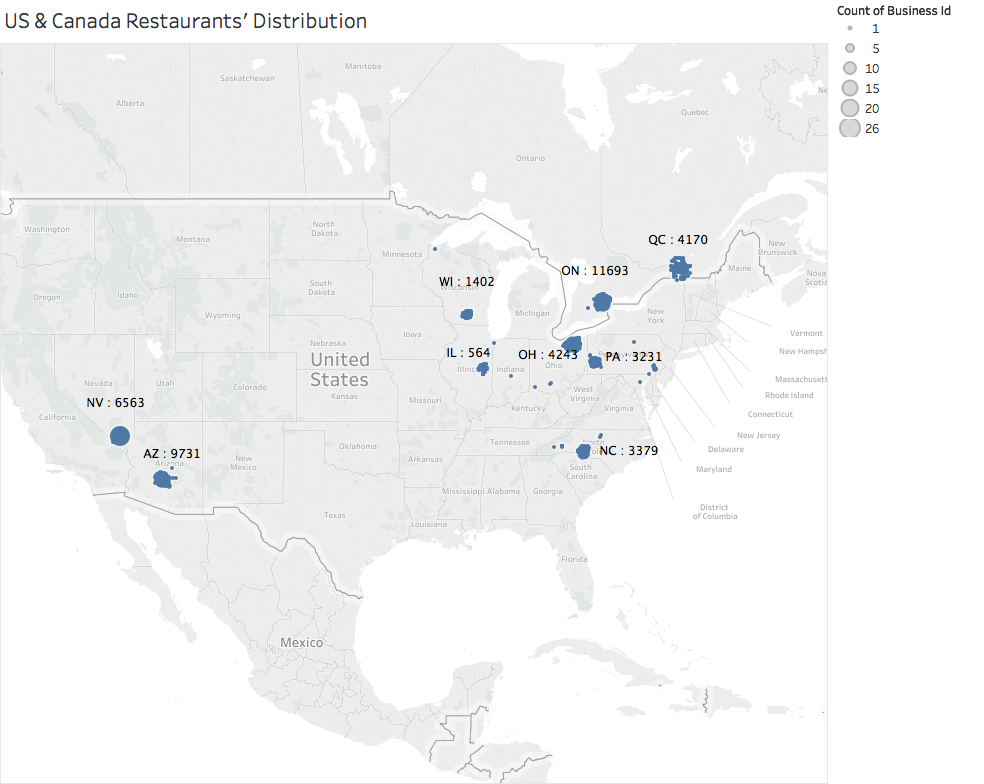
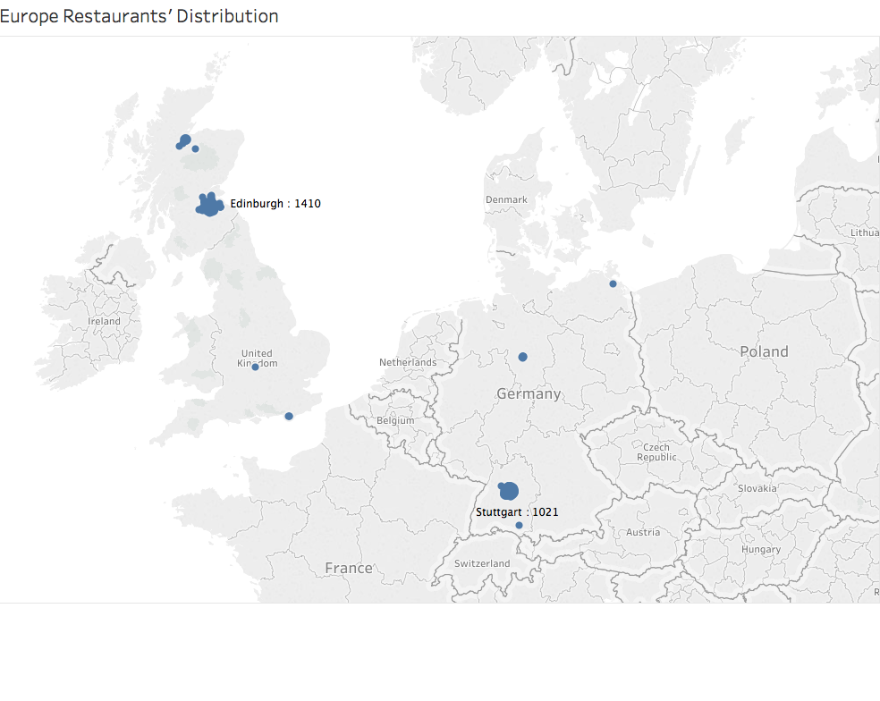
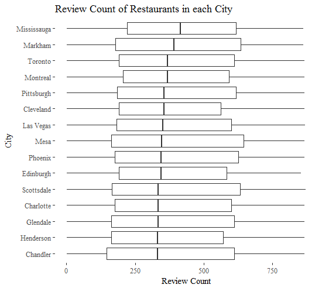

```{r}
# Install packages
library(tidyverse)
library(stringr)
library(ggplot2)
library(ggthemes)
```
```{r}
# Data Wrangling
yelp_business <- read.csv("~/Documents/Columbia/5069_Applied Data Science/Project/business.csv")

restaurants <- yelp_business %>%
  separate(categories, into = c("cat1", "cat2", "cat3", "cat4", "cat5", "cat6", "cat7", "cat8", 
                                "cat9"), sep = ",") %>%
  separate(cat1, into = c("c1f", "cat1", "c1b"), sep = "'") %>%
  separate(cat2, into = c("c2f", "cat2", "c2b"), sep = "'") %>%
  separate(cat3, into = c("c3f", "cat3", "c3b"), sep = "'") %>%
  separate(cat4, into = c("c4f", "cat4", "c4b"), sep = "'") %>%
  separate(cat5, into = c("c5f", "cat5", "c5b"), sep = "'") %>%
  separate(cat6, into = c("c6f", "cat6", "c6b"), sep = "'") %>%
  separate(cat7, into = c("c7f", "cat7", "c7b"), sep = "'") %>%
  separate(cat8, into = c("c8f", "cat8", "c8b"), sep = "'") %>%
  separate(cat9, into = c("c9f", "cat9", "c9b"), sep = "'") %>%
  select(city, name, business_id, state, stars, review_count, cat1, cat2, cat3, cat4, cat5, 
         cat6, cat7, cat8, cat9) %>%
  filter(cat1 == "Restaurants" | 
           cat2 == "Restaurants" | 
           cat3 == "Restaurants" | 
           cat4 == "Restaurants" | 
           cat5 == "Restaurants" | 
           cat6 == "Restaurants" | 
           cat7 == "Restaurants" | 
           cat8 == "Restaurants" | 
           cat9 == "Restaurants" )
```

```{r}
restaurants <- read.csv("~/Documents/Columbia/5069_Applied Data Science/Project/restaurants.csv")
```

```{r}
# 1 Restaurant Count by City
restaurants_count <- restaurants %>%
  group_by(city) %>% 
  summarise(
    n = n()
  ) %>%
  filter(n > 500)

c1 <- unlist(unique(restaurants_count[, "city"]))

ggplot(restaurants_count, aes(x = reorder(city, n), y = n)) + 
  geom_col(width = 0.7, fill = "skyblue") + 
  labs(x = "City", y = "Number of Restaurants") + 
  theme_tufte() + 
  ggtitle("Cities with over 500 Restaurants") + 
  coord_flip() + 
  geom_text(aes(label = n), vjust = 0)
```





```{r}
# 2 Proportion of Star Ratings by City
restaurants_rating <- restaurants %>%
  group_by(city, stars) %>%
  filter(city %in% c1) %>%
  summarise(
    n = n()
  ) %>%
  spread(key = stars, value = n) %>%
  mutate(
    star1 = `1` + `1.5`,
    star2 = `2` + `2.5`,
    star3 = `3` + `3.5`,
    star4 = `4` + `4.5`,
    star5 = `5`
  ) %>%
  select(city, star1, star2, star3, star4, star5) %>%
  gather(star1, star2, star3, star4, star5, key = "star", value = "n")

ggplot(restaurants_rating) + 
  geom_bar(aes(x = city, y = n, fill = star), stat = "identity", position = "fill") + 
  theme_tufte() + 
  theme(axis.text.x = element_text(colour = "grey20", size = 11, angle = 45, hjust = 1, 
                                   vjust = 1, face = "italic")) + 
  ggtitle(" Distribution of Restaurants' Ratings") + 
  labs(x = "City", y = "Proportion")
```

```{r}
# 3 Review Count by City
restaurants_review_bp <- restaurants %>%
  select(city, review_count) %>%
  group_by(city) %>%
  filter(city %in% c1) 

ggplot(restaurants_review_bp, aes(x = reorder(city, as.numeric(review_count), FUN = median), 
                                  y = as.numeric(review_count))) + 
  geom_boxplot(alpha = 0.3) + 
  coord_flip() + 
  ggtitle("Review Count of Restaurants in each City") + 
  labs(x = "City", y ="Review Count") + 
  theme_tufte()
```



```{r}
# Bucket Count of Reviews by City
summary(restaurants$review_count) # to see quartiles
restaurants$review_bucket <- ifelse(restaurants$review_count < 7, "1", 
                                    ifelse(restaurants$review_count < 17 & restaurants$review_count >= 7, "2", 
                                           ifelse(restaurants$review_count < 48 & restaurants$review_count >= 17, "3", "4")))

restaurants_review <- restaurants %>%
  group_by(city, review_bucket) %>%
  filter(city %in% c1) %>%
  summarise(
    n = n()
  )
```

